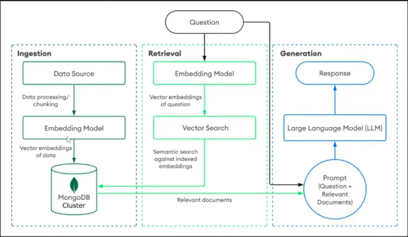
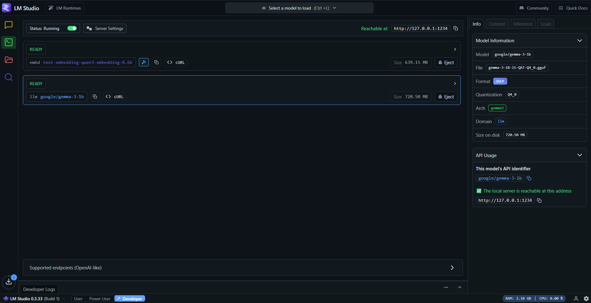

# MongoDB RAG (Retrieval-Augmented Generation)



## Overview
This project demonstrates a full Retrieval-Augmented Generation (RAG) pipeline using MongoDB as a vector database and OpenAI-compatible models (e.g., via LM Studio) for embeddings and generation. The workflow covers data ingestion, vector search, and answer generation.


## Architecture
The following diagram illustrates the architecture of the RAG implementation:


## Features
- **Modern Python project setup** using [uv](https://github.com/astral-sh/uv) for fast, reliable dependency management.
- **PDF ingestion and chunking** using `langchain` and `pypdf` for efficient document processing.
- **Embeddings** generated with OpenAI-compatible models (tested with LM Studio, but can be adapted for other providers).
- **MongoDB Atlas** for scalable storage and fast vector search of document embeddings.
- **Vector search and retrieval** using MongoDB's vector index for semantic search.
- **LLM-based answer generation** from retrieved context, enabling advanced question answering.
- **Jupyter Notebook workflow** for easy experimentation and reproducibility.
- **Extensible design**: Easily adapt to other embedding models, databases, or document types.


## Project Structure
- `main.py`: Entry point (demo/placeholder).
- `mongo_db_connection.py`: MongoDB connection logic and test connection.
- `rag.ipynb`: Jupyter notebook with the full RAG workflow (data ingestion, retrieval, generation).
- `requirements.txt` / `pyproject.toml`: Project dependencies and metadata.
- `media/`: Project images and diagrams (see below).


## Setup Instructions
1. **Clone the repository**
2. **Install dependencies** (recommended: use `uv`):
  ```sh
  uv pip install -r requirements.txt
  ```
  Or use pip:
  ```sh
  pip install -r requirements.txt
  ```
3. **Configure MongoDB**: Update your MongoDB credentials in `mongo_db_connection.py` and in the notebook as needed.
4. **Run the notebook**: Open `rag.ipynb` in Jupyter and execute the cells in order for data ingestion, retrieval, and generation.
5. **(Optional) Set up LM Studio**: Refer to the image below for LM Studio configuration if using local models.


## Images
- 
  - *Project architecture overview*
- 
  - *Example LM Studio configuration for local embedding/generation*


## Example Workflow
1. **Ingest PDF**: Load and split a PDF, generate embeddings, and store them in MongoDB.
2. **Create Vector Index**: Set up a vector index in MongoDB for efficient similarity search.
3. **Query**: Embed a user query, retrieve the most relevant document chunks from MongoDB.
4. **Generate Answer**: Use an LLM to generate an answer from the retrieved context.
5. **Iterate and Experiment**: Modify the notebook to try different models, chunking strategies, or data sources.


---

## Best Practices & Tips
- Always keep your MongoDB credentials secure. Use environment variables or secrets management for production.
- For large PDFs, consider adjusting chunk size and overlap for optimal retrieval.
- Experiment with different embedding models for best results.
- Use GPU acceleration in LM Studio or your embedding server for faster processing.
- Regularly update dependencies for security and performance.

## LM Studio Setup Example
Below is an example of how to configure LM Studio for local embedding and generation:


---

*Project initialized and managed with `uv`.*

